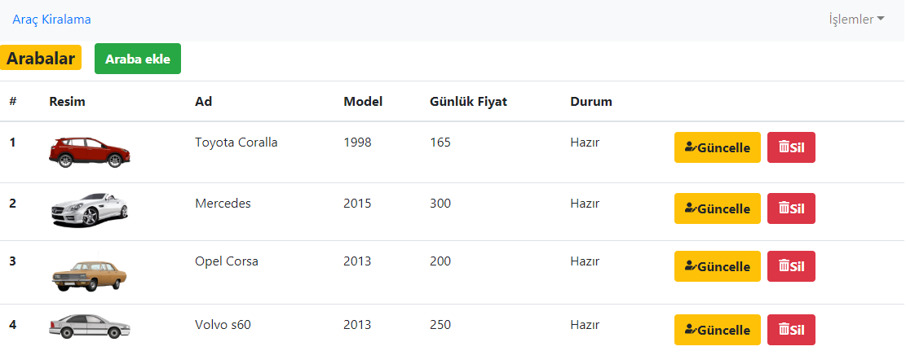
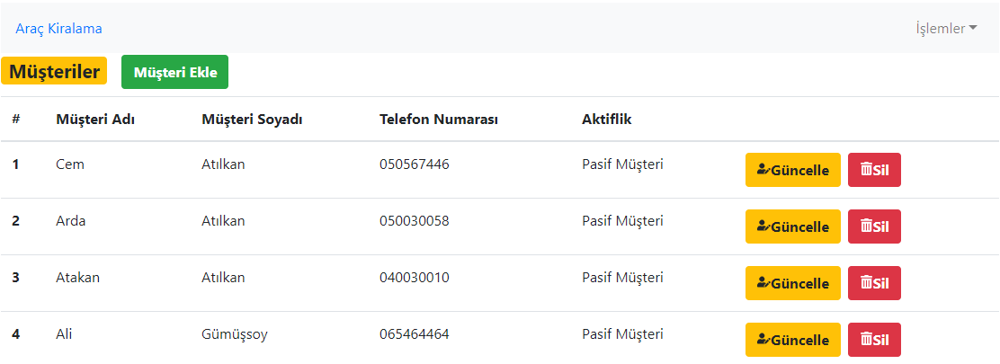
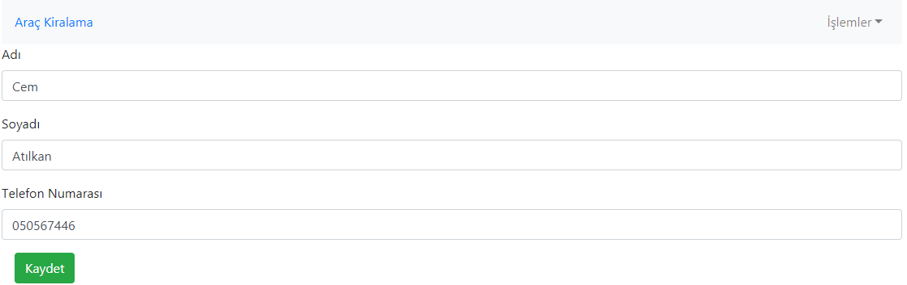

## Araç Kiralama Sistemi

Proje araç kiralama, iade alma, ekleme, silme ve güncelleme işlemlerini ve müşteriler ile ilgili ekleme, silme ve güncelleme işlemlerini içermektedir.

Projenin çalıştırılması için gerekli komutlar;

```
    cd api
    json-server --watch db.json
    cd projeDizini
    npm install
    npm start
```

##### Ana Sayfa


##### Araba Listesi



##### Müşteri Listesi



##### Müşteri Güncelleme



## Projeye Eklenmesi Planlanan Özellikler

- Araç kiralama ve iade alma tarihlerinin sisteme dahil edilmesi, kiralama ve iade süreleri arasındaki fark ile toplam ücretin hesaplanması.

- Araba eklerken resim ekleme işleminin text yerine upload işlemi ile gerçekleştirilmesi.

- Müşteri veya araba ekleme ya da güncelleme işlemlerinde validasyon işlemlerinin gerçekleştirilmesi.