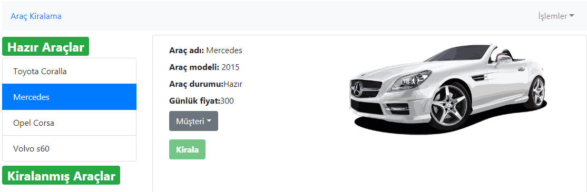

## Araç Kiralama Sistemi

Proje araç kiralama, iade alma, ekleme, silme ve güncelleme işlemlerini ve müşteriler ile ilgili ekleme, silme ve güncelleme işlemlerini içermektedir.

Projenin çalıştırılması için gerekli komutlar;

```
    cd api
    json-server --watch db.json
    cd projeDizini
    npm install
    npm start
```

##### Ana Sayfa

<p>
    
</p>

##### Araba Listesi

<p>
    
</p>

##### Müşteri Listesi

<p>
    
</p>

##### Müşteri Güncelleme

<p>
    
</p>